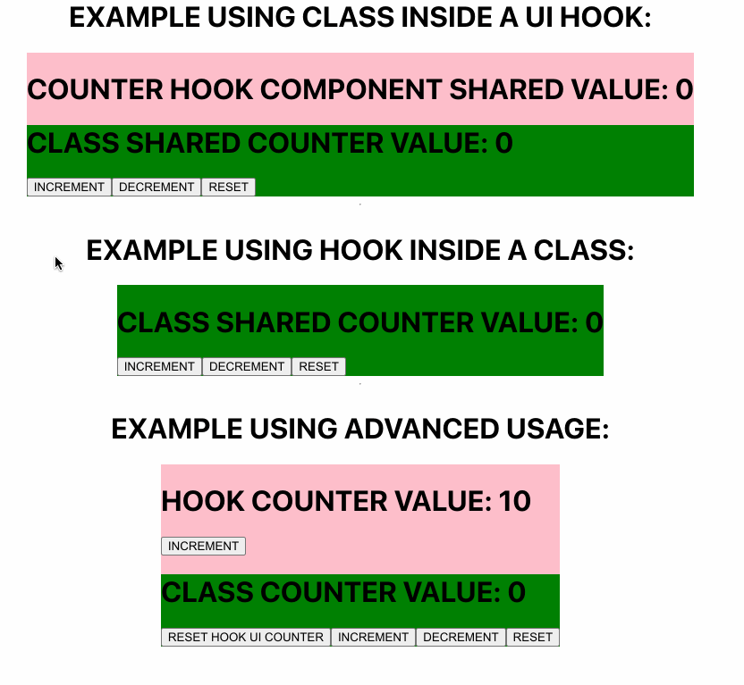

# react-hoist-hook-class

> Don't refactor your code, just install this library 😁

[](https://www.npmjs.com/package/react-hoist-hook-class) [](https://standardjs.com)

## Install

npm:

```bash
npm install --save react-hoist-hook-class
```

yarn:

```bash
yarn add react-hoist-hook-class
```

## What is this library for?

This library makes hook and class interoperability smooth, written in TypeScript, fully typed to ensure each component expects its right props 🎯

(Works with React & React-Native, no external libraries needed 🚀)

## Exported methods

<table>
  <tr>
    <th>Name</th>
    <th>Usage</th>
    <th>Details</th>
  </tr>
  <tr>
    <td>
      <code>withHook</code>
    </td>
    <td>
      <code>withHook(ClassComponent [, injectedProps])(useHook [, args])</code>
    </td>
    <td>Inject returned values from a custom hook</td>
  </tr>
  <tr>
    <td>
      <code>withUIHook</code>
    </td>
    <td>
      <code>withUIHook(HookUIComponent)(ClassComponent)</code>
    </td>
    <td>Inject Class component as a <code>children</code> to your function component in order to pass custom props to it
    </td>
  </tr>
</table>

## Visual example (GIF)



## Basic usage (hocs)

### withHook

```tsx
import React, { PureComponent, useState } from 'react';
import { withHook } from 'react-hoist-hook-class';

function useCounter(defaultCounter: number = 0, boost: number = 1) {
  const [counter, setCounter] = useState<number>(defaultCounter);

  return {
    counter,
    increment: () => setCounter((c) => c + boost),
    decrement: () => setCounter((c) => c - boost),
    reset: () => setCounter(0)
  };
}

type ClassProps = ReturnType<typeof useCounter>;

class ClassCounterHook extends PureComponent<ClassProps> {
  render() {
    const { counter, increment, decrement, reset } = this.props;

    return (
      <div>
        <h1>CLASS COUNTER VALUE: {counter}</h1>
        <button onClick={increment}>INCREMENT</button>
        <button onClick={decrement}>DECREMENT</button>
        <button onClick={reset}>RESET</button>
      </div>
    );
  }
}

export const ExampleWithHook = () =>
  withHook(ClassCounterHook)(useCounter, 10, 20);
```

### withUIHook

```tsx
import React, { PureComponent, useState } from 'react';
import { withUIHook } from 'react-hoist-hook-class';

function useCounter(defaultCounter: number = 0, boost: number = 1) {
  const [counter, setCounter] = useState<number>(defaultCounter);

  return {
    counter,
    increment: () => setCounter((c) => c + boost),
    decrement: () => setCounter((c) => c - boost),
    reset: () => setCounter(0)
  };
}

type ClassProps = ReturnType<typeof useCounter>;

interface CounterHookProps {
  children(): React.ReactNode;
  children(props: ClassProps): React.ReactNode;
}

function CounterHookSharedVersion({ children }: CounterHookProps) {
  const { counter, increment, decrement, reset } = useCounter(0);

  return (
    <div className='counter__div_hook'>
      <h1>COUNTER HOOK COMPONENT SHARED VALUE: {counter}</h1>
      {children({ counter, increment, decrement, reset })}
    </div>
  );
}

class CounterClassSharedVersion extends PureComponent<ClassProps & OtherProps> {
  render() {
    const { counter, increment, decrement, reset } = this.props;

    return (
      <div>
        <h1>CLASS SHARED COUNTER VALUE: {counter}</h1>
        <button onClick={increment}>INCREMENT</button>
        <button onClick={decrement}>DECREMENT</button>
        <button onClick={reset}>RESET</button>
      </div>
    );
  }
}

export const ClassWithUIHook = () =>
  withUIHook(CounterHookSharedVersion)(CounterClassSharedVersion);
```

### Advanced usage

```tsx
import React, { PureComponent, useState } from 'react';
import { withHook, withUIHook } from 'react-hoist-hook-class';

function useCounter(defaultCounter: number = 0, boost: number = 1) {
  const [counter, setCounter] = useState<number>(defaultCounter);

  return {
    counter,
    increment: () => setCounter((c) => c + boost),
    decrement: () => setCounter((c) => c - boost),
    reset: () => setCounter(0)
  };
}

type CounterHook = ReturnType<typeof useCounter>;

type HookChildrenProps = {
  resetUIHook: () => void;
};

type ClassProps = CounterHook & HookChildrenProps;

interface HookProps {
  children(): React.ReactNode;
  children(props: HookChildrenProps): React.ReactNode;
}

class ClassWithCounterHookAndPropsFromHook extends PureComponent<ClassProps> {
  render() {
    const { counter, increment, decrement, reset, resetUIHook } = this.props;

    return (
      <div>
        <h1>CLASS COUNTER VALUE: {counter}</h1>
        <button onClick={resetUIHook}>RESET HOOK UI COUNTER</button>
        <button onClick={increment}>INCREMENT</button>
        <button onClick={decrement}>DECREMENT</button>
        <button onClick={reset}>RESET</button>
      </div>
    );
  }
}

const ClassWithCounterHookUI = (props: HookChildrenProps) =>
  withHook(ClassWithCounterHookAndPropsFromHook, props)(useCounter, 0, 10);

function HookRenderingClassPassingCustomProps({ children }: HookProps) {
  const { counter, increment, reset: resetUIHook } = useCounter(10, 50);

  return (
    <div>
      <h1>HOOK COUNTER VALUE: {counter}</h1>
      <button onClick={increment}>INCREMENT</button>
      {children({ resetUIHook })}
    </div>
  );
}

export const AdvancedUsage = () =>
  withUIHook(HookRenderingClassPassingCustomProps)(ClassWithCounterHookUI);
```

## License

MIT © [x0s3](https://github.com/x0s3)
